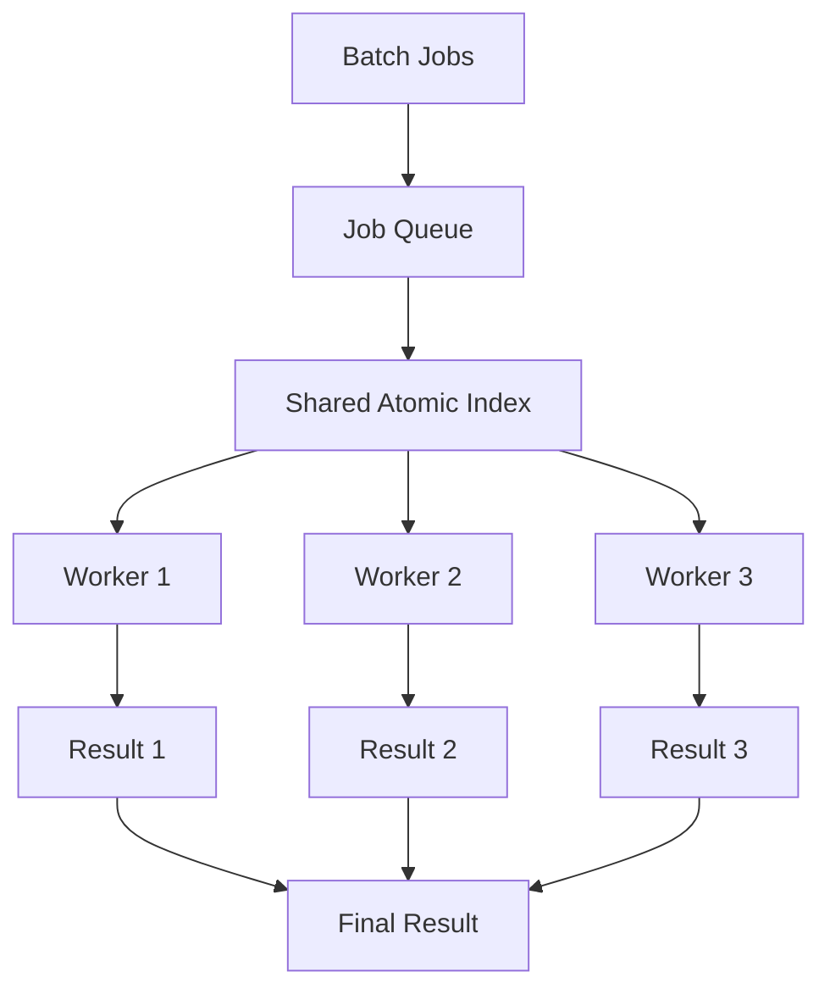

```mermaid
flowchart TD
    A[Batch Jobs] --> B[Job Queue]
    B --> C[Shared Atomic Index]

    C --> W1[Worker 1]
    C --> W2[Worker 2]
    C --> W3[Worker 3]

    W1 --> R1[Result 1]
    W2 --> R2[Result 2]
    W3 --> R3[Result 3]

    R1 --> F[Final Result]
    R2 --> F
    R3 --> F
```
